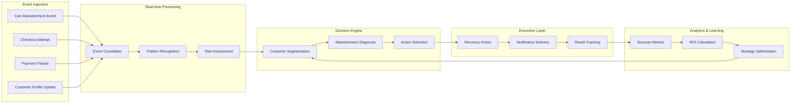

# 🏗️ System Architecture Diagram

## Overview

The AI Abandoned Cart Recovery Agent is built on Elastic's complete serverless platform, orchestrating multiple components to deliver intelligent, context-aware cart recovery.

## Architecture Components

```mermaid
graph TB
    subgraph "Data Sources"
        CE[Cart Events]
        CHE[Checkout Events]
        PL[Payment Logs]
        CP[Customer Profiles]
        SM[Session Metrics]
    end

    subgraph "Elasticsearch Serverless"
        ES[Elasticsearch Cluster]
        ES --> CE
        ES --> CHE
        ES --> PL
        ES --> CP
        ES --> SM
    end

    subgraph "Workflow Engine"
        WF[Serverless Workflow]
        WF --> ES
    end

    subgraph "AI Layer"
        AI[AI Assistant]
        AB[Agent Builder]
        AI --> WF
        AB --> AI
    end

    subgraph "Decision Logic"
        DM[Decision Matrix]
        CS[Customer Segmentation]
        AR[Abandonment Reasoning]
        FR[Fraud Risk Assessment]
        
        DM --> CS
        DM --> AR
        DM --> FR
        WF --> DM
    end

    subgraph "Recovery Actions"
        PR[Payment Retry]
        FS[Free Shipping]
        DIS[Discount Offer]
        REM[Reminder Only]
        BLK[Blocked Action]
        
        DM --> PR
        DM --> FS
        DM --> DIS
        DM --> REM
        DM --> BLK
    end

    subgraph "Output & Tracking"
        RH[Recovery History]
        NOT[Notification Service]
        ANAL[Analytics Dashboard]
        
        WF --> RH
        WF --> NOT
        RH --> ANAL
    end

    subgraph "External Systems"
        EMAIL[Email Service]
        SMS[SMS Gateway]
        PUSH[Push Notification]
        WEBHOOK[Webhook API]
        
        NOT --> EMAIL
        NOT --> SMS
        NOT --> PUSH
        NOT --> WEBHOOK
    end

    style ES fill:#f3f9ff
    style WF fill:#e8f4fd
    style AI fill:#fff4e6
    style DM fill:#f0f9ff
    style RH fill:#f0fdf4
```

## Data Flow Architecture

## Component Interactions

### 1. **Data Layer**
- **Cart Events**: Real-time cart activity tracking
- **Checkout Events**: Checkout process monitoring
- **Payment Logs**: Transaction failure analysis
- **Customer Profiles**: Historical behavior and segmentation
- **Session Metrics**: Performance and user experience data

### 2. **Processing Layer**
- **Elasticsearch**: Unified data storage and real-time queries
- **Workflow Engine**: Orchestration of multi-step processes
- **AI Assistant**: Natural language interface and intelligent decision-making

### 3. **Decision Layer**
- **Decision Matrix**: Multi-variable logic for action selection
- **Customer Segmentation**: VIP, Standard, High Fraud Risk classification
- **Abandonment Reasoning**: Payment failure, shipping issues, browsing abandonment
- **Fraud Risk Assessment**: Real-time risk scoring and guardrails

### 4. **Action Layer**
- **Payment Retry**: Alternative payment method offering
- **Free Shipping**: Address shipping cost concerns
- **Discount Offer**: Strategic discount based on cart value
- **Reminder Only**: Low-risk engagement for fraud cases
- **Blocked Action**: Fraud prevention measure

### 5. **Output Layer**
- **Recovery History**: Complete audit trail and analytics
- **Notification Service**: Multi-channel delivery (email, SMS, push)
- **Analytics Dashboard**: Performance metrics and insights

## Technology Stack

### **Elastic Serverless Platform**
- **Elasticsearch**: Real-time search and analytics
- **Workflows**: Orchestration and automation
- **AI Assistant**: Natural language processing
- **Agent Builder**: Tool integration and guardrails

### **Integration Patterns**
- **Event-driven architecture** for real-time processing
- **Microservices pattern** for scalable components
- **API-first design** for external integrations
- **Immutable data structures** for audit trails

### **Security & Compliance**
- **Role-based access control** for data protection
- **Encryption at rest and in transit** for security
- **Audit logging** for compliance requirements
- **Data retention policies** for privacy

## Scalability Considerations

### **Horizontal Scaling**
- **Serverless architecture** automatically scales with demand
- **Distributed processing** handles thousands of carts simultaneously
- **Load balancing** ensures optimal performance
- **Auto-scaling** adapts to traffic patterns

### **Performance Optimization**
- **Index optimization** for fast query responses
- **Caching strategies** reduce database load
- **Batch processing** for efficient bulk operations
- **Connection pooling** for resource management

### **Reliability Features**
- **Fault tolerance** with automatic failover
- **Retry mechanisms** for transient failures
- **Circuit breakers** prevent cascading failures
- **Health monitoring** for proactive issue detection

## Integration Points

### **External Systems**
- **Payment Gateways**: Stripe, PayPal, Apple Pay
- **Email Services**: SendGrid, Mailgun, AWS SES
- **SMS Providers**: Twilio, Vonage, AWS SNS
- **Push Platforms**: Firebase, OneSignal, AWS SNS

### **API Endpoints**
- **Webhook receivers** for real-time events
- **REST APIs** for system integration
- **GraphQL queries** for flexible data access
- **Streaming endpoints** for real-time updates

This architecture demonstrates how modern serverless platforms can power complex, intelligent automation systems that scale efficiently while maintaining security and reliability.
