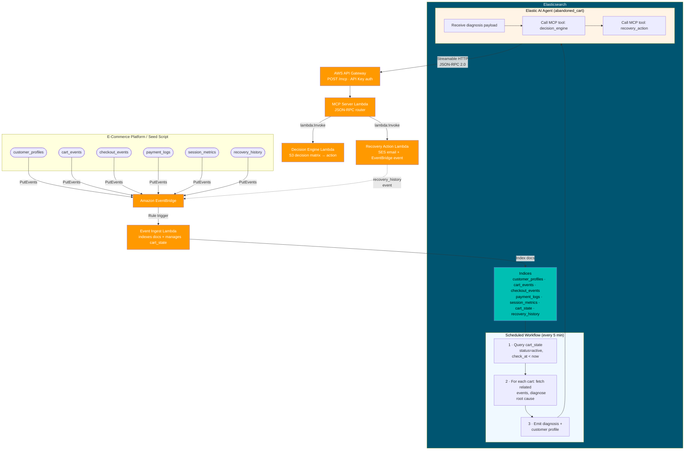

# System Architecture Diagram

## Overview

The AI Abandoned Cart Recovery Agent combines **AWS EventBridge + Lambda** for
event ingestion, **Elasticsearch** for storage and scheduled workflows, and an
**Elastic AI Agent** that calls two **MCP tools** (Decision Engine & Recovery
Action) hosted behind an **API Gateway**.

---

## High-Level Architecture

```
┌──────────────────────────────────────────────────────────────────────────────┐
│  E-Commerce Platform / Seed Script                                          │
│                                                                             │
│  Emits events:                                                              │
│    • customer_profiles   • cart_events      • checkout_events               │
│    • payment_logs        • session_metrics   • recovery_history             │
└────────────────────────────────┬─────────────────────────────────────────────┘
                                 │  PutEvents
                                 ▼
┌──────────────────────────────────────────────────────────────────────────────┐
│                        Amazon EventBridge                                    │
│                     (custom event bus)                                       │
└────────────────────────────────┬─────────────────────────────────────────────┘
                                 │  Rule triggers
                                 ▼
┌──────────────────────────────────────────────────────────────────────────────┐
│                    Event Ingest Lambda                                       │
│                                                                             │
│  • Indexes each event into its Elasticsearch index                          │
│  • Creates / updates  cart_state  (active → completed → recovery_sent)      │
└────────────────────────────────┬─────────────────────────────────────────────┘
                                 │  elasticsearch-py
                                 ▼
┌──────────────────────────────────────────────────────────────────────────────┐
│                        Elasticsearch                                        │
│                                                                             │
│  Indices:                                                                   │
│    customer_profiles │ cart_events │ checkout_events                         │
│    payment_logs      │ session_metrics │ cart_state │ recovery_history       │
│                                                                             │
│ ┌──────────────────────────────────────────────────────────────────────────┐ │
│ │  Scheduled Workflow: detect_abandonment_reasons  (every 5 min)          │ │
│ │                                                                        │ │
│ │  1. Query  cart_state  (status=active, check_at < now)                 │ │
│ │  2. For each abandoned cart:                                           │ │
│ │     a. Fetch customer_profiles, cart_events, checkout_events,          │ │
│ │        payment_logs, session_metrics                                   │ │
│ │     b. Diagnose root cause:                                            │ │
│ │        payment_failure │ pricing_shipping │ performance_latency         │ │
│ │        browsing_or_window_shopping │ unknown                           │ │
│ │     c. Emit diagnosis + customer profile data                          │ │
│ │                                                                        │ │
│ │  3. Call  Elastic AI Agent  ──────────────────────────────┐            │ │
│ └──────────────────────────────────────────────────────────────┘          │ │
│                                                              │            │ │
│ ┌──────────────────────────────────────────────────────────────┐          │ │
│ │  Elastic AI Agent  (agent_id: abandoned_cart)              │            │ │
│ │                                                            │            │ │
│ │  Receives diagnosis payload and calls MCP tools:           │            │ │
│ │    1. decision_engine  → get recommended action            │            │ │
│ │    2. recovery_action  → send recovery message             │            │ │
│ └───────────────┬────────────────────────────────────────────┘            │ │
└─────────────────┼────────────────────────────────────────────────────────────┘
                  │  Streamable HTTP (JSON-RPC 2.0)
                  │  x-api-key header
                  ▼
┌──────────────────────────────────────────────────────────────────────────────┐
│                        AWS API Gateway                                       │
│                   POST /mcp  (API Key auth)                                  │
└────────────────────────────────┬─────────────────────────────────────────────┘
                                 │
                                 ▼
┌──────────────────────────────────────────────────────────────────────────────┐
│                       MCP Server Lambda                                      │
│                   (JSON-RPC 2.0 router)                                      │
│                                                                             │
│  Methods: initialize │ ping │ tools/list │ tools/call                        │
└───────────┬──────────────────────────────┬───────────────────────────────────┘
            │ lambda:InvokeFunction         │ lambda:InvokeFunction
            ▼                               ▼
┌─────────────────────────┐   ┌──────────────────────────────┐
│  Decision Engine Lambda │   │  Recovery Action Lambda       │
│                         │   │                              │
│  • Reads decision       │   │  • Sends email via SES       │
│    matrix from S3       │   │  • Publishes recovery_history│
│  • Resolves action by   │   │    event to EventBridge      │
│    segment, reason,     │   │    (loops back to ingest)    │
│    cart value, fraud    │   │                              │
│  • Returns: action,     │   │  • Returns: status, channel, │
│    discount, message    │   │    message_id, sent_at       │
└─────────────────────────┘   └──────────────────────────────┘
```

---

## Mermaid Diagram


```mermaid
flowchart TD
    subgraph Sources["E-Commerce Platform / Seed Script"]
        CP_E([customer_profiles])
        CE_E([cart_events])
        CHE_E([checkout_events])
        PL_E([payment_logs])
        SM_E([session_metrics])
        RH_E([recovery_history])
    end

    EB["Amazon EventBridge"]

    CP_E & CE_E & CHE_E & PL_E & SM_E & RH_E -->|PutEvents| EB

    INGEST["Event Ingest Lambda
    indexes docs + manages cart_state"]

    EB -->|Rule trigger| INGEST

    subgraph ES["Elasticsearch"]
        direction TB
        IDX["Indices
        customer_profiles · cart_events · checkout_events
        payment_logs · session_metrics · cart_state · recovery_history"]

        subgraph WF["Scheduled Workflow (every 5 min)"]
            direction TB
            W1["1 · Query cart_state
            status=active, check_at < now"]
            W2["2 · For each cart: fetch related
            events, diagnose root cause"]
            W3["3 · Emit diagnosis +
            customer profile"]
            W1 --> W2 --> W3
        end

        subgraph AGENT["Elastic AI Agent (abandoned_cart)"]
            A1["Receive diagnosis payload"]
            A2["Call MCP tool: decision_engine"]
            A3["Call MCP tool: recovery_action"]
            A1 --> A2 --> A3
        end

        IDX --- WF
        W3 --> AGENT
    end

    INGEST -->|Index docs| IDX

    APIGW["AWS API Gateway
    POST /mcp · API Key auth"]

    AGENT -->|"Streamable HTTP
    JSON-RPC 2.0"| APIGW

    MCP["MCP Server Lambda
    JSON-RPC router"]
    APIGW --> MCP

    DE["Decision Engine Lambda
    S3 decision matrix → action"]
    RA["Recovery Action Lambda
    SES email + EventBridge event"]

    MCP -->|"lambda:Invoke"| DE
    MCP -->|"lambda:Invoke"| RA

    RA -.->|"recovery_history
    event"| EB

    style EB fill:#ff9900,color:#fff
    style INGEST fill:#ff9900,color:#fff
    style ES fill:#005571,color:#fff
    style IDX fill:#00bfb3,color:#000
    style WF fill:#f0f9ff,color:#000
    style AGENT fill:#fff4e6,color:#000
    style APIGW fill:#ff9900,color:#fff
    style MCP fill:#ff9900,color:#fff
    style DE fill:#ff9900,color:#fff
    style RA fill:#ff9900,color:#fff
```

---

## Flow Summary

| Step | Component | Description |
|------|-----------|-------------|
| **1** | **EventBridge → Event Ingest Lambda → Elasticsearch** | All events (customer_profiles, cart_events, checkout_events, payment_logs, session_metrics, recovery_history) are emitted to EventBridge. A Lambda function indexes each event into the corresponding Elasticsearch index and maintains a `cart_state` document per cart. |
| **2** | **Elasticsearch Scheduled Workflow** | `detect_abandonment_reasons` runs every 5 minutes. It queries `cart_state` for active carts past their `check_at` time, fetches related data from all indices, and diagnoses the root cause of abandonment (payment failure, shipping cost, latency, browsing, or unknown). |
| **3** | **Elastic AI Agent** | The workflow calls an AI agent (`abandoned_cart`) with the full diagnosis payload including cart data, customer profile, and root cause signals. |
| **4** | **MCP Tools via API Gateway** | The agent calls two tools sequentially through the MCP Server (Streamable HTTP, API Key auth): |
| 4a | **Decision Engine** | Reads the decision matrix from S3 and returns the recommended action (discount, free shipping, payment retry, reminder, or blocked) based on customer segment, abandonment reason, cart value, and fraud risk. |
| 4b | **Recovery Action** | Sends a recovery email via Amazon SES and publishes a `recovery_history` event back to EventBridge, which loops through the ingest pipeline for tracking. |

---

## Feedback Loop

The Recovery Action Lambda publishes a `recovery_history` event back to
EventBridge. The Event Ingest Lambda picks it up and updates `cart_state` to
`recovery_sent`, closing the loop and preventing duplicate recovery attempts.
