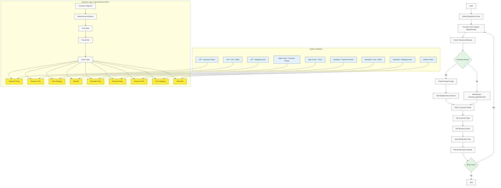

# Serverless Workflow Diagram

## 🔄 Complete Abandoned Cart Recovery Workflow



## 📋 Workflow Steps

### A. Detect Abandoned Carts
**Purpose**: Find abandoned carts from last 24 hours
**Input**: Time range (now-1440m), cart events
**Output**: List of abandoned cart IDs
**Query**: cart_events index with event_type=add_to_cart, no checkout_completed field
**Key Fields**: `@timestamp`, `event_type`, `cart_id`, `customer_id`, `cart_value`

### B. Analyze Abandonment Reasons (Foreach Loop)
**Purpose**: For each abandoned cart, diagnose abandonment reasons
**Input**: Cart ID from detection step
**Output**: Root cause analysis and customer data

#### B1. Check Checkout Attempts
**Purpose**: Determine if customer started checkout
**Query**: checkout_events index by cart_id
**Output**: Latest checkout attempt with step and status

#### B2. Conditional Step
**Purpose**: Only proceed if checkout attempts exist and weren't completed
**Condition**: checkout attempts > 0 AND status != "completed"

#### B3. Check Payment Logs
**Purpose**: Identify payment failures
**Query**: payment_logs index by cart_id
**Output**: Latest payment attempt with status and failure details

#### B4. Add Abandonment Reason
**Purpose**: Determine root cause using Liquid templating
**Logic**:
- If payment.status == "failed" → "payment_failure"
- If checkout.step == "shipping" AND status != "completed" → "shipping_issue"
- Default → "browsing_abandonment"

#### B5. Fetch Customer Profile
**Purpose**: Get customer segmentation and preferences
**Query**: customer_profiles index by customer_id
**Output**: Customer segment, fraud risk, contact details

#### B6. Set Customer Data
**Purpose**: Consolidate all relevant data for decision making
**Output**: Combined dataset of cart, customer, and abandonment data

#### B7. Set Recovery Action
**Purpose**: Complex decision logic for action selection
**Factors**: Customer segment, fraud risk, cart value, abandonment reason
**Output**: Action type, discount percentage, free shipping flag

#### B8. Send Notification
**Purpose**: Prepare HTTP request data (uses data.set, not actual HTTP call)
**Output**: Structured notification payload for external API

#### B9. Record Recovery Attempt
**Purpose**: Log recovery attempt for analytics
**Action**: Index document to recovery_history
**Output**: Complete recovery record with timestamp and status

---

## 🎯 Decision Logic Matrix

### Action Types & Conditions

| Customer Segment | Abandonment Reason | Cart Value | Action | Details |
|------------------|-------------------|------------|---------|---------|
| **VIP** | payment_failure | Any | payment_retry | Alternative payment method |
| **VIP** | Any | >$500 | discount | 15% discount |
| **VIP** | shipping_issue | Any | free_shipping | Remove shipping barrier |
| **VIP** | Other | ≤$500 | free_shipping | VIP benefit |
| **High Fraud Risk** | payment_failure | Any | blocked | No action |
| **High Fraud Risk** | Any | Any | reminder_only | Gentle reminder only |
| **Standard** | payment_failure | Any | payment_retry | Alternative payment method |
| **Standard** | Any | >$300 | discount | 10% discount |
| **Standard** | shipping_issue | Any | free_shipping | Remove shipping barrier |
| **Standard** | Other | Any | reminder | Standard reminder |

### Success Indicators

- **High Success**: VIP + Payment Retry (85% estimated)
- **Medium Success**: Standard + Free Shipping (65% estimated)
- **Low Success**: Standard + Reminder (40% estimated)
- **Blocked**: High Fraud Risk (0% - no action taken)

---

## 🔧 Technical Implementation

### Elasticsearch Queries

#### Detect Abandoned Carts
```json
{
  "index": "cart_events",
  "query": {
    "bool": {
      "must": [
        {"term": {"event_type": "add_to_cart"}},
        {"range": {"@timestamp": {"gte": "now-1440m"}}}
      ],
      "must_not": [
        {"exists": {"field": "checkout_completed"}}
      ]
    }
  }
}
```

#### Checkout Analysis
```json
{
  "index": "checkout_events",
  "query": {
    "term": {"cart_id": "{{cart_id}}"}
  },
  "size": 1,
  "sort": "@timestamp"
}
```

#### Payment Logs
```json
{
  "index": "payment_logs",
  "query": {
    "term": {"cart_id": "{{cart_id}}"}
  },
  "size": 1,
  "sort": "@timestamp"
}
```

#### Customer Profile
```json
{
  "index": "customer_profiles",
  "query": {
    "term": {"customer_id": "{{customer_id}}"}
  },
  "size": 1
}
```

### Data Flow

```
Cart Events → Detect Abandonment (24h window) → For Each Cart:
      ↓                    ↓                         ↓
   Time-based           Check Checkout          If checkout exists:
   Aggregation           attempts by cart        → Check payment logs
      ↓                    ↓                         ↓
   Find carts            Determine if            Determine abandonment
   with add_to_cart      checkout started         reason (payment/shipment/browsing)
      ↓                    ↓                         ↓
   No checkout           Fetch customer          Apply decision logic:
   completed field        profile & segment        → VIP: payment_retry/discount/free_shipping
      ↓                    ↓                         → Standard: payment_retry/discount/free_shipping
   Loop through          Set customer data        → High Fraud: blocked/reminder_only
   each cart             → Set recovery action    → Default: reminder
      ↓                    ↓                         ↓
   Prepare notification  Record attempt          Send notification data
   data payload          to recovery_history     → Index recovery history
```

### Serverless Benefits

- **🚀 Scalability**: No infrastructure management
- **💰 Cost-effective**: Pay-per-execution model
- **🔒 Security**: Built-in authentication and authorization
- **📊 Monitoring**: Complete audit trail in recovery_history
- **🎯 Intelligence**: Context-aware decision making
- **⚡ Performance**: Sub-second execution times

---

## 🎪 Integration Points

### Agent Builder Integration
- **Workflow Tool**: Uses `elastic-workflows/serverless_workflow.yml`
- **AI Model**: GPT-4o-mini for decision support
- **Guardrails**: Business rules embedded in workflow logic
- **Chat Interface**: Natural language commands and responses

### External Systems
- **Recovery Service**: HTTP endpoint for email/SMS/push
- **Analytics**: Kibana dashboards for performance monitoring
- **Learning**: Recovery history analysis for strategy optimization

This workflow demonstrates a complete, production-ready abandoned cart recovery system using Elastic Serverless and AI Agent Builder.
