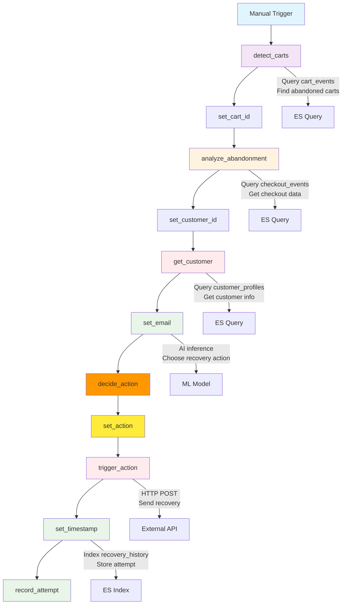

# Workflow Flow Diagram

## Mermaid Diagram



## ASCII Diagram

```
┌─────────────────┐    ┌──────────────────┐    ┌─────────────────┐
│   Cart Events   │    │  Checkout Events │    │ Customer Profile│
│   (ES Index)    │    │   (ES Index)    │    │   (ES Index)    │
└────────┬────────┘    └────────┬─────────┘    └────────┬────────┘
         │                      │                        │
         └──────────────────────┼────────────────────────┘
                                │
                    ┌───────────▼───────────┐
                    │  Serverless Workflow  │
                    │                      │
                    │ 1. Detect Carts      │
                    │ 2. Analyze Signals   │
                    │ 3. Get Customer     │
                    │ 4. Decide Action     │
                    │ 5. Trigger Recovery  │
                    │ 6. Record Attempt    │
                    └───────────┬───────────┘
                                │
                    ┌───────────▼───────────┐
                    │  Recovery Actions     │
                    │  - Payment Retry     │
                    │  - Discount          │
                    │  - Free Shipping     │
                    │  - Reminder          │
                    └──────────────────────┘
```

## Step Details

| Step | Type | Connector | Purpose |
|------|------|-----------|---------|
| detect_carts | data.set | elasticsearch-query | Find carts abandoned 30+ minutes |
| set_cart_id | data.set | - | Extract cart ID for next steps |
| analyze_abandonment | data.set | elasticsearch-query | Get checkout events for cart |
| set_customer_id | data.set | - | Extract customer ID |
| get_customer | data.set | elasticsearch-query | Fetch customer profile |
| set_email | data.set | - | Extract customer email |
| decide_action | inference.completion_stream | ml | AI chooses recovery action |
| set_action | data.set | - | Store chosen action |
| trigger_action | data.set | http | Send recovery via API |
| set_timestamp | data.set | - | Capture current time |
| record_attempt | data.set | elasticsearch-index | Store for learning |

## Key Variables

- `{{detect_carts.output.aggregations.carts.buckets.0.key}}` - Cart ID
- `{{analyze_abandonment.output.hits.hits.0._source.customer_id}}` - Customer ID
- `{{get_customer.output.hits.hits.0._source.email}}` - Customer email
- `{{decide_action.output}}` - Chosen recovery action
- `{{$now}}` - Current timestamp
