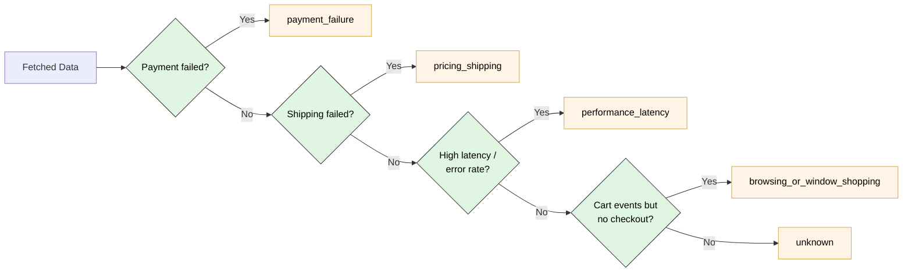

# Serverless Workflow Diagram

## Overview

The `detect_abandonment_reasons` workflow runs on a **5-minute schedule** inside
Elasticsearch. It finds abandoned carts, diagnoses the root cause using data
from multiple indices, and hands the result to an **Elastic AI Agent** that
calls two **MCP tools** (Decision Engine and Recovery Action) to resolve each
cart.

---

## Complete Workflow Flow


```mermaid
flowchart TD
    TRIGGER["Scheduled Trigger (every 5 min)"]

    subgraph S1["Step 1 — Find Abandoned Carts"]
        Q1["elasticsearch.search
        index: cart_state
        status = active AND check_at < now
        size: 100, sort: check_at"]
    end

    subgraph S2["Step 2 — Extract Cart Data"]
        EX["data.set
        carts = hits → _source"]
    end

    subgraph S3["Step 3 — Conditional: carts.length > 0"]
        direction TB

        FE["foreach cart"]

        subgraph FETCH["Fetch Related Data"]
            F1["fetch_customer_profile
            index: customer_profiles
            by customer_id"]
            F2["fetch_cart_events
            index: cart_events
            by cart_id"]
            F3["fetch_latest_checkout
            index: checkout_events
            by cart_id"]
            F4["fetch_latest_payment
            index: payment_logs
            by cart_id"]
            F5["fetch_session_metrics
            index: session_metrics
            by session_id"]
        end

        subgraph DIAG["Diagnose Root Cause"]
            D1{"payment exists
            AND status = failed?"}
            D1 -->|Yes| R1["root_cause: payment_failure
            signals: failure_code, failure_message"]

            D2{"checkout exists
            AND step = shipping_failed?"}
            D2 -->|Yes| R2["root_cause: pricing_shipping
            signals: shipping_cost, step"]

            D3{"session_metrics exists
            AND (p95 > 1000ms
            OR error_rate > 5%)?"}
            D3 -->|Yes| R3["root_cause: performance_latency
            signals: p95_latency_ms, error_rate"]

            D4{"cart_events exist
            AND no checkout?"}
            D4 -->|Yes| R4["root_cause: browsing_or_window_shopping
            signals: cart_events_count"]

            D5{"no payment, no checkout,
            no session data?"}
            D5 -->|Yes| R5["root_cause: unknown
            signals: insufficient_signals"]
        end

        EMIT["emit_final_diagnosis (data.set)
        cart_id, customer_id, cart_value,
        currency, device_type, last_seen,
        session_id, check_at,
        customer_profile, final_diagnosis"]

        subgraph AGENT["Elastic AI Agent (abandoned_cart)"]
            A1["Receive diagnosis payload"]
            A2["Call MCP tool: decision_engine
            → recommended action, incentive, priority"]
            A3["Call MCP tool: recovery_action
            → send email, log recovery_history"]
            A1 --> A2 --> A3
        end

        FE --> FETCH --> DIAG --> EMIT --> AGENT
    end

    TRIGGER --> S1 --> S2 --> S3

    classDef trigger fill:#ff9900,color:#fff,stroke:#c77700
    classDef search fill:#005571,color:#fff,stroke:#003d52
    classDef data fill:#00bfb3,color:#000,stroke:#009e94
    classDef condition fill:#e1f5e3,color:#000,stroke:#333
    classDef diagnosis fill:#fff4e6,color:#000,stroke:#d4a84b
    classDef agent fill:#7c3aed,color:#fff,stroke:#5b21b6

    class TRIGGER trigger
    class Q1,F1,F2,F3,F4,F5 search
    class EX,EMIT data
    class D1,D2,D3,D4,D5 condition
    class R1,R2,R3,R4,R5 diagnosis
    class A1,A2,A3 agent
```

---

## Step-by-Step Breakdown

### Step 1 — `find_abandoned_carts`

| Field | Value |
|-------|-------|
| **Type** | `elasticsearch.search` |
| **Index** | `cart_state` |
| **Query** | `status = "active"` AND `check_at < now` |
| **Size** | 100 |
| **Sort** | `check_at` ascending |
| **Fields returned** | `cart_id`, `customer_id`, `last_seen`, `check_at`, `status`, `cart_value`, `currency`, `device_type`, `session_id` |

---

### Step 2 — `extract_cart_data`

| Field | Value |
|-------|-------|
| **Type** | `data.set` |
| **Purpose** | Maps `hits.hits` → `_source` into a `carts` array for iteration |

---

### Step 3 — Conditional + Foreach

Only runs when `carts.length > 0`. Iterates over each abandoned cart and
executes the sub-steps below.

---

#### 3a. Fetch Related Data

Five parallel Elasticsearch queries per cart:

| Step | Index | Lookup Key | Fields |
|------|-------|-----------|--------|
| `fetch_customer_profile` | `customer_profiles` | `customer_id` | segment, lifetime_value, preferred_channel, fraud_risk, email, phone |
| `fetch_cart_events` | `cart_events` | `cart_id` | All fields (size 10) |
| `fetch_latest_checkout` | `checkout_events` | `cart_id` | All fields (size 1) |
| `fetch_latest_payment` | `payment_logs` | `cart_id` | All fields (size 1) |
| `fetch_session_metrics` | `session_metrics` | `session_id` (from cart events) | All fields (size 1) |

---

#### 3b. Diagnose Root Cause

Five conditional branches evaluated in order. The **first match wins** via
Liquid templating in the final diagnosis step.

| Branch | Condition | Root Cause | Signals |
|--------|-----------|-----------|---------|
| `decide_payment_failure` | Payment log exists AND `status = "failed"` | `payment_failure` | `failure_code`, `failure_message` |
| `decide_checkout_shipping` | Checkout exists AND `step = "shipping_failed"` | `pricing_shipping` | `shipping_cost`, `step` |
| `decide_performance` | Session metrics exist AND (`p95_latency_ms > 1000` OR `error_rate > 0.05`) | `performance_latency` | `p95_latency_ms`, `error_rate` |
| `decide_browse` | Cart events exist AND **no** checkout events | `browsing_or_window_shopping` | `cart_events_count` |
| `decide_unknown` | No payment, no checkout, no session data | `unknown` | `insufficient_signals` |

**Priority order** (Liquid `if/elsif`):
`payment_failure` → `pricing_shipping` → `performance_latency` → `browsing_or_window_shopping` → `unknown`

---

#### 3c. Emit Final Diagnosis

Consolidates all collected data into a single payload:

```
{
  cart_id, customer_id, cart_value, currency,
  device_type, last_seen, session_id, check_at,
  customer_profile: {
    segment, lifetime_value, preferred_channel,
    fraud_risk, email, phone
  },
  final_diagnosis: { root_cause, signals }
}
```

---

#### 3d. Call Elastic AI Agent

| Field | Value |
|-------|-------|
| **Type** | `ai.agent` |
| **Agent ID** | `abandoned_cart` |
| **Input** | Full `emit_final_diagnosis` payload |

The agent receives the diagnosis and executes **two MCP tool calls** in
sequence:

**Tool 1 — `decision_engine`**

| Parameter | Source |
|-----------|--------|
| `cart_id` | `emit_final_diagnosis.cart_id` |
| `customer_id` | `emit_final_diagnosis.customer_id` |
| `cart_value` | `emit_final_diagnosis.cart_value` |
| `currency` | `emit_final_diagnosis.currency` |
| `root_cause` | Extracted from `final_diagnosis` |
| `customer_segment` | `customer_profile.segment` |
| `lifetime_value` | `customer_profile.lifetime_value` |
| `fraud_risk` | `customer_profile.fraud_risk` |

**Returns**: `recommended_action`, `incentive`, `priority`, `reasoning`

**Tool 2 — `recovery_action`**

| Parameter | Source |
|-----------|--------|
| `cart_id` | `emit_final_diagnosis.cart_id` |
| `customer_id` | `emit_final_diagnosis.customer_id` |
| `recommended_action` | From decision engine result |
| `incentive` | From decision engine result |
| `channel` | `customer_profile.preferred_channel` |
| `email` | `customer_profile.email` |
| `phone` | `customer_profile.phone` |

**Returns**: `status`, `channel_used`, `message_id`, `sent_at`

---

#### Agent Response Schema

```json
{
  "decision_engine_result": {
    "recommended_action": "string",
    "incentive": "string",
    "priority": "high | medium | low",
    "reasoning": "string"
  },
  "recovery_action_result": {
    "status": "sent | failed | queued",
    "channel_used": "email | sms | push",
    "message_id": "string",
    "sent_at": "ISO 8601 timestamp"
  },
  "summary": "Brief summary of the complete recovery process"
}
```

---

## Diagnosis Priority Flow


```mermaid
flowchart LR
    START["Fetched Data"] --> D1{"Payment failed?"}
    D1 -->|Yes| R1["payment_failure"]
    D1 -->|No| D2{"Shipping failed?"}
    D2 -->|Yes| R2["pricing_shipping"]
    D2 -->|No| D3{"High latency /
    error rate?"}
    D3 -->|Yes| R3["performance_latency"]
    D3 -->|No| D4{"Cart events but
    no checkout?"}
    D4 -->|Yes| R4["browsing_or_window_shopping"]
    D4 -->|No| R5["unknown"]

    classDef cause fill:#fff4e6,color:#000,stroke:#d4a84b
    classDef check fill:#e1f5e3,color:#000,stroke:#333
    class R1,R2,R3,R4,R5 cause
    class D1,D2,D3,D4 check
```

---

## Indices Used

| Index | Role in Workflow |
|-------|-----------------|
| `cart_state` | Source of abandoned carts (status = active, check_at expired) |
| `customer_profiles` | Customer segment, fraud risk, contact info |
| `cart_events` | Cart activity history (add_to_cart events) |
| `checkout_events` | Checkout progress and failures |
| `payment_logs` | Payment attempt outcomes |
| `session_metrics` | Page latency and error rates |

---

## Data Flow (ASCII)

```
Scheduled Trigger (every 5 min)
       │
       ▼
  ┌─────────────────────────────────────────┐
  │  Query cart_state                        │
  │  status=active, check_at < now           │
  └──────────────────┬──────────────────────┘
                     │  up to 100 carts
                     ▼
  ┌─────────────────────────────────────────┐
  │  Extract _source into carts array        │
  └──────────────────┬──────────────────────┘
                     │  if carts.length > 0
                     ▼
            ┌────────────────┐
            │  foreach cart   │◄──────────────────────────────┐
            └───────┬────────┘                                │
                    │                                         │
    ┌───────────────┼───────────────┐                         │
    ▼               ▼               ▼                         │
 customer      cart_events     checkout_events                │
 profiles      (size 10)      (size 1)                        │
    │               │               │                         │
    │               ▼               ▼                         │
    │          session_metrics  payment_logs                   │
    │          (by session_id)  (size 1)                       │
    │               │               │                         │
    └───────────────┼───────────────┘                         │
                    ▼                                         │
         ┌────────────────────┐                               │
         │  Diagnose root     │                               │
         │  cause (5 branches)│                               │
         └────────┬───────────┘                               │
                  ▼                                           │
         ┌────────────────────┐                               │
         │  emit_final_       │                               │
         │  diagnosis         │                               │
         └────────┬───────────┘                               │
                  ▼                                           │
         ┌────────────────────┐                               │
         │  AI Agent          │                               │
         │  (abandoned_cart)  │                               │
         │                    │                               │
         │  1. decision_engine│ ──► recommended action        │
         │  2. recovery_action│ ──► send email + log history  │
         └────────┬───────────┘                               │
                  │                                           │
                  │  next cart ────────────────────────────────┘
                  ▼
               [ Done ]
```
