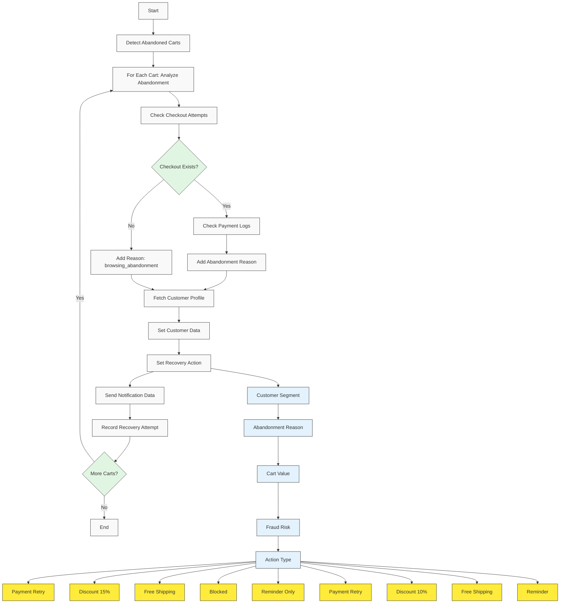
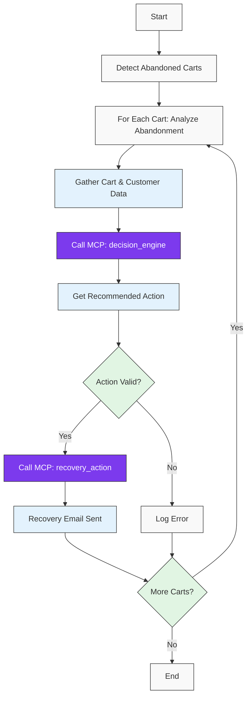

# Serverless Workflow Diagram

## 🔄 Complete Abandoned Cart Recovery Workflow


```mermaid
flowchart TD
    A[Start] --> B[Detect Abandoned Carts]
    B --> C[For Each Cart: Analyze Abandonment]
    C --> D[Check Checkout Attempts]
    D --> E{Checkout Exists?}
    E -->|Yes| F[Check Payment Logs]
    E -->|No| G[Add Reason: browsing_abandonment]
    F --> H[Add Abandonment Reason]
    H --> I[Fetch Customer Profile]
    G --> I
    I --> J[Set Customer Data]
    J --> K[Set Recovery Action]
    K --> L[Send Notification Data]
    L --> M[Record Recovery Attempt]
    M --> N{More Carts?}
    N -->|Yes| C
    N -->|No| O[End]

    K --> K1[Customer Segment]
    K1 --> K2[Abandonment Reason]
    K2 --> K3[Cart Value]
    K3 --> K4[Fraud Risk]
    K4 --> K5[Action Type]
    
    K5 --> P1[Payment Retry]
    K5 --> P2[Discount 15%]
    K5 --> P3[Free Shipping]
    K5 --> P4[Blocked]
    K5 --> P5[Reminder Only]
    K5 --> P6[Payment Retry]
    K5 --> P7[Discount 10%]
    K5 --> P8[Free Shipping]
    K5 --> P9[Reminder]

    classDef default fill:#f9f9f9,stroke:#333,color:#333
    classDef decision fill:#e1f5e3,stroke:#333,color:#333
    classDef action fill:#ffeb3b,stroke:#333,color:#333
    classDef process fill:#e3f2fd,stroke:#333,color:#333
    class E,N decision
    class P1,P2,P3,P4,P5,P6,P7,P8,P9 action
    class K1,K2,K3,K4,K5 process
```

## 📋 Workflow Steps

### A. Detect Abandoned Carts
**Purpose**: Find abandoned carts from last 24 hours
**Input**: Time range (now-1440m), cart events
**Output**: List of abandoned cart IDs
**Query**: cart_events index with event_type=add_to_cart, no checkout_completed field
**Key Fields**: `@timestamp`, `event_type`, `cart_id`, `customer_id`, `cart_value`

### B. Analyze Abandonment Reasons (Foreach Loop)
**Purpose**: For each abandoned cart, diagnose abandonment reasons
**Input**: Cart ID from detection step
**Output**: Root cause analysis and customer data

#### B1. Check Checkout Attempts
**Purpose**: Determine if customer started checkout
**Query**: checkout_events index by cart_id
**Output**: Latest checkout attempt with step and status

#### B2. Conditional Step
**Purpose**: Only proceed if checkout attempts exist and weren't completed
**Condition**: checkout attempts > 0 AND status != "completed"

#### B3. Check Payment Logs
**Purpose**: Identify payment failures
**Query**: payment_logs index by cart_id
**Output**: Latest payment attempt with status and failure details

#### B4. Add Abandonment Reason
**Purpose**: Determine root cause using Liquid templating
**Logic**:
- If payment.status == "failed" → "payment_failure"
- If checkout.step == "shipping" AND status != "completed" → "shipping_issue"
- Default → "browsing_abandonment"

#### B5. Fetch Customer Profile
**Purpose**: Get customer segmentation and preferences
**Query**: customer_profiles index by customer_id
**Output**: Customer segment, fraud risk, contact details

#### B6. Set Customer Data
**Purpose**: Consolidate all relevant data for decision making
**Output**: Combined dataset of cart, customer, and abandonment data

#### B7. Set Recovery Action
**Purpose**: Complex decision logic for action selection
**Factors**: Customer segment, fraud risk, cart value, abandonment reason
**Output**: Action type, discount percentage, free shipping flag

#### B8. Send Notification
**Purpose**: Prepare HTTP request data (uses data.set, not actual HTTP call)
**Output**: Structured notification payload for external API

#### B9. Record Recovery Attempt
**Purpose**: Log recovery attempt for analytics
**Action**: Index document to recovery_history
**Output**: Complete recovery record with timestamp and status

---

## 🎯 Decision Logic Matrix

### Action Types & Conditions

| Customer Segment | Abandonment Reason | Cart Value | Action | Details |
|------------------|-------------------|------------|---------|---------|
| **VIP** | payment_failure | Any | payment_retry | Alternative payment method |
| **VIP** | Any | >$500 | discount | 15% discount |
| **VIP** | shipping_issue | Any | free_shipping | Remove shipping barrier |
| **VIP** | Other | ≤$500 | free_shipping | VIP benefit |
| **High Fraud Risk** | payment_failure | Any | blocked | No action |
| **High Fraud Risk** | Any | Any | reminder_only | Gentle reminder only |
| **Standard** | payment_failure | Any | payment_retry | Alternative payment method |
| **Standard** | Any | >$300 | discount | 10% discount |
| **Standard** | shipping_issue | Any | free_shipping | Remove shipping barrier |
| **Standard** | Other | Any | reminder | Standard reminder |

### Success Indicators

- **High Success**: VIP + Payment Retry (85% estimated)
- **Medium Success**: Standard + Free Shipping (65% estimated)
- **Low Success**: Standard + Reminder (40% estimated)
- **Blocked**: High Fraud Risk (0% - no action taken)

---

## 🔧 Technical Implementation

### Elasticsearch Queries

#### Detect Abandoned Carts
```json
{
  "index": "cart_events",
  "query": {
    "bool": {
      "must": [
        {"term": {"event_type": "add_to_cart"}},
        {"range": {"@timestamp": {"gte": "now-1440m"}}}
      ],
      "must_not": [
        {"exists": {"field": "checkout_completed"}}
      ]
    }
  }
}
```

#### Checkout Analysis
```json
{
  "index": "checkout_events",
  "query": {
    "term": {"cart_id": "{{cart_id}}"}
  },
  "size": 1,
  "sort": "@timestamp"
}
```

#### Payment Logs
```json
{
  "index": "payment_logs",
  "query": {
    "term": {"cart_id": "{{cart_id}}"}
  },
  "size": 1,
  "sort": "@timestamp"
}
```

#### Customer Profile
```json
{
  "index": "customer_profiles",
  "query": {
    "term": {"customer_id": "{{customer_id}}"}
  },
  "size": 1
}
```

### Data Flow

```
Cart Events → Detect Abandonment (24h window) → For Each Cart:
      ↓                    ↓                         ↓
   Time-based           Check Checkout          If checkout exists:
   Aggregation           attempts by cart        → Check payment logs
      ↓                    ↓                         ↓
   Find carts            Determine if            Determine abandonment
   with add_to_cart      checkout started         reason (payment/shipment/browsing)
      ↓                    ↓                         ↓
   No checkout           Fetch customer          Apply decision logic:
   completed field        profile & segment        → VIP: payment_retry/discount/free_shipping
      ↓                    ↓                         → Standard: payment_retry/discount/free_shipping
   Loop through          Set customer data        → High Fraud: blocked/reminder_only
   each cart             → Set recovery action    → Default: reminder
      ↓                    ↓                         ↓
   Prepare notification  Record attempt          Send notification data
   data payload          to recovery_history     → Index recovery history
```

### Serverless Benefits

- **🚀 Scalability**: No infrastructure management
- **💰 Cost-effective**: Pay-per-execution model
- **🔒 Security**: Built-in authentication and authorization
- **📊 Monitoring**: Complete audit trail in recovery_history
- **🎯 Intelligence**: Context-aware decision making
- **⚡ Performance**: Sub-second execution times

---

## 🎪 Integration Points

### Agent Builder Integration
- **Workflow Tool**: Uses `elastic-workflows/serverless_workflow.yml`
- **AI Model**: GPT-4o-mini for decision support
- **Guardrails**: Business rules embedded in workflow logic
- **Chat Interface**: Natural language commands and responses

### External Systems
- **Recovery Service**: HTTP endpoint for email/SMS/push
- **Analytics**: Kibana dashboards for performance monitoring
- **Learning**: Recovery history analysis for strategy optimization

### MCP (Model Context Protocol) Server Integration
- **Endpoint**: `https://85vaz0z5p1.execute-api.us-east-1.amazonaws.com/v1/mcp`
- **Protocol**: JSON-RPC 2.0 over Streamable HTTP
- **Authentication**: API key via `x-api-key` header
- **Transport**: RESTful HTTP with CORS support
- **Tools Exposed**: `decision_engine`, `recovery_action`

---

## 🌐 MCP Server Overview

The **Model Context Protocol (MCP) Server** provides a standardized interface to the abandoned cart recovery system, enabling:

- **AI/LLM Integration**: Connect Claude, GPT-4, or other AI models as clients
- **Programmatic Access**: Call decision engine and recovery action via HTTP
- **Tool Composition**: Chain multiple tools for complex recovery workflows
- **Batch Processing**: Support for bulk cart recovery operations

### Architecture

```
┌─────────────────────────────────────┐
│   MCP Client (AI Model / Agent)     │
│   (Claude, GPT-4, Custom Tools)     │
└────────────┬────────────────────────┘
             │ JSON-RPC 2.0
             │ x-api-key authentication
             ▼
┌─────────────────────────────────────┐
│   API Gateway (API Key Auth)        │
│   ✓ 100 req/s throttling            │
│   ✓ 10,000 req/day quota            │
└────────────┬────────────────────────┘
             │
             ▼
┌─────────────────────────────────────┐
│   MCP Server Lambda                 │
│   (JSON-RPC 2.0 Handler)            │
└────────┬──────────────────┬─────────┘
         │                  │
    ┌────▼───┐          ┌───▼────┐
    │Decision│          │Recovery│
    │Engine  │◄─invoke─►│ Action │
    │Lambda  │          │ Lambda │
    └────────┘          └────────┘
         │                  │
    ┌────▼──────────────────▼────┐
    │  AWS Lambda Functions      │
    │  - S3 (decision matrix)    │
    │  - SES (email recovery)    │
    │  - EventBridge (history)   │
    └────────────────────────────┘
```

---

## 🛠️ MCP Tools Available

### 1. decision_engine

**Purpose**: Determine the best recovery action for an abandoned cart

**Input Parameters**:
- `cart_id` (string): Unique cart identifier
- `customer_id` (string): Customer identifier
- `user_segment` (enum): `VIP`, `standard`, `high_fraud_risk`
- `abandonment_reason` (enum): `payment_failure`, `shipping_issue`, `browsing_abandonment`, `performance_latency`, `unknown`
- `cart_value` (number, optional): Total cart value for threshold checks
- `fraud_risk` (enum, optional): `low`, `medium`, `high`

**Output**: Recommended recovery action with type, discount (optional), and message

**Example Request**:
```json
{
  "jsonrpc": "2.0",
  "id": 1,
  "method": "tools/call",
  "params": {
    "name": "decision_engine",
    "arguments": {
      "cart_id": "cart_12345",
      "customer_id": "cust_001",
      "user_segment": "VIP",
      "abandonment_reason": "payment_failure",
      "cart_value": 500.00,
      "fraud_risk": "low"
    }
  }
}
```

**Example Response**:
```json
{
  "jsonrpc": "2.0",
  "id": 1,
  "result": {
    "content": [{
      "type": "text",
      "text": "{\n  \"cart_id\": \"cart_12345\",\n  \"recommended_action\": {\n    \"type\": \"payment_retry\",\n    \"discount\": null,\n    \"message\": \"Your payment didn't go through. Please try again.\"\n  }\n}"
    }],
    "isError": false
  }
}
```

### 2. recovery_action

**Purpose**: Send recovery email via Amazon SES and log recovery history to EventBridge

**Input Parameters**:
- `cart_id` (string): Unique cart identifier
- `customer_id` (string): Customer identifier
- `email` (string): Customer email address
- `customer_name` (string, optional): Customer name for greeting
- `recommended_action` (object): Action details from decision_engine
  - `type` (enum): `payment_retry`, `discount`, `free_shipping`, `reminder`, `reminder_only`, `blocked`
  - `discount` (string, optional): Discount amount (e.g., "15%")
  - `message` (string): Recovery message for email

**Output**: Recovery attempt record with status and message ID

**Example Request**:
```json
{
  "jsonrpc": "2.0",
  "id": 2,
  "method": "tools/call",
  "params": {
    "name": "recovery_action",
    "arguments": {
      "cart_id": "cart_12345",
      "customer_id": "cust_001",
      "email": "customer@example.com",
      "customer_name": "Jane Doe",
      "recommended_action": {
        "type": "discount",
        "discount": "15%",
        "message": "Complete your purchase and get 15% off!"
      }
    }
  }
}
```

**Example Response**:
```json
{
  "jsonrpc": "2.0",
  "id": 2,
  "result": {
    "content": [{
      "type": "text",
      "text": "{\n  \"cart_id\": \"cart_12345\",\n  \"recovery_id\": \"rec_abc123def456\",\n  \"action_taken\": \"discount\",\n  \"send_result\": {\n    \"status\": \"sent\",\n    \"channel\": \"email\",\n    \"message_id\": \"<AWS-SES-Message-ID>\"\n  }\n}"
    }],
    "isError": false
  }
}
```

---

## 📡 MCP Protocol Methods

| Method | Purpose | Requires Auth |
|--------|---------|---------------|
| `initialize` | MCP handshake, returns server info | No |
| `ping` | Health check | No |
| `tools/list` | Get available tools and schemas | Yes |
| `tools/call` | Execute a tool | Yes |

### Health Check (GET)

```bash
curl https://85vaz0z5p1.execute-api.us-east-1.amazonaws.com/v1/mcp \
  -H 'x-api-key: <YOUR_API_KEY>'
```

Response:
```json
{
  "server": "ai-abandoned-cart-recovery-mcp",
  "version": "1.0.0",
  "protocolVersion": "2025-03-26",
  "status": "healthy",
  "transport": "streamable-http",
  "tools": ["decision_engine", "recovery_action"]
}
```

---

## 🔐 Authentication & Security

### API Key Management

1. **Retrieve API Key**:
   ```bash
   AWS_REGION=us-east-1
   API_KEY_ID=$(aws cloudformation describe-stacks \
     --stack-name ai-abandoned-cart-recovery-dev \
     --query "Stacks[0].Outputs[?OutputKey=='McpApiKeyId'].OutputValue" \
     --output text)
   
   API_KEY=$(aws apigateway get-api-key \
     --api-key "$API_KEY_ID" \
     --include-value \
     --query "value" \
     --output text)
   ```

2. **Include in Every Request**:
   ```bash
   curl -H 'x-api-key: '${API_KEY}'' ...
   ```

### Throttling & Quotas

- **Rate Limit**: 100 requests/second
- **Daily Quota**: 10,000 requests/day
- **Burst Capacity**: 50 requests/second

### CORS Support

- Enabled for `*` origin (configurable)
- Supports preflight requests (OPTIONS method)
- Headers: `Content-Type`, `Authorization`, `X-Api-Key`, `Mcp-Session-Id`

---

## 🤖 Using with AI Models / Agents

### Claude Desktop Configuration

Add to `claude_desktop_config.json`:

```json
{
  "mcpServers": {
    "abandoned-cart-recovery": {
      "url": "https://85vaz0z5p1.execute-api.us-east-1.amazonaws.com/v1/mcp",
      "transport": "streamable-http",
      "headers": {
        "x-api-key": "<YOUR_API_KEY>"
      }
    }
  }
}
```

### Workflow Integration (Programmatic)

Use the MCP tools in your recovery workflow:

```python
import httpx
import json

MCP_URL = "https://85vaz0z5p1.execute-api.us-east-1.amazonaws.com/v1/mcp"
API_KEY = "<YOUR_API_KEY>"

def call_decision_engine(cart_id, customer_id, user_segment, reason):
    payload = {
        "jsonrpc": "2.0",
        "id": 1,
        "method": "tools/call",
        "params": {
            "name": "decision_engine",
            "arguments": {
                "cart_id": cart_id,
                "customer_id": customer_id,
                "user_segment": user_segment,
                "abandonment_reason": reason
            }
        }
    }
    
    response = httpx.post(
        MCP_URL,
        json=payload,
        headers={"x-api-key": API_KEY}
    )
    return response.json()

def call_recovery_action(cart_id, customer_id, email, action):
    payload = {
        "jsonrpc": "2.0",
        "id": 2,
        "method": "tools/call",
        "params": {
            "name": "recovery_action",
            "arguments": {
                "cart_id": cart_id,
                "customer_id": customer_id,
                "email": email,
                "recommended_action": action
            }
        }
    }
    
    response = httpx.post(
        MCP_URL,
        json=payload,
        headers={"x-api-key": API_KEY}
    )
    return response.json()

# Usage
decision = call_decision_engine("cart_001", "cust_001", "VIP", "payment_failure")
action = json.loads(decision["result"]["content"][0]["text"])["recommended_action"]
recovery = call_recovery_action("cart_001", "cust_001", "customer@example.com", action)
```

---

## 📊 Complete Workflow with MCP Integration


```mermaid
flowchart TD
    A[Start] --> B[Detect Abandoned Carts]
    B --> C[For Each Cart: Analyze Abandonment]
    C --> D[Gather Cart & Customer Data]
    D --> E["Call MCP: decision_engine"]
    E --> F["Get Recommended Action"]
    F --> G{Action Valid?}
    G -->|Yes| H["Call MCP: recovery_action"]
    G -->|No| I[Log Error]
    H --> J["Recovery Email Sent"]
    J --> K{More Carts?}
    K -->|Yes| C
    K -->|No| L[End]
    I --> K
    
    classDef default fill:#f9f9f9,stroke:#333,color:#333
    classDef mcp fill:#7c3aed,stroke:#333,color:#fff
    classDef process fill:#e3f2fd,stroke:#333,color:#333
    classDef decision fill:#e1f5e3,stroke:#333,color:#333
    class E,H mcp
    class D,F,J process
    class G,K decision
```

---

This workflow demonstrates a complete, production-ready abandoned cart recovery system using AWS Lambda, Elastic Serverless, MCP Protocol, and AI Agent Builder.
